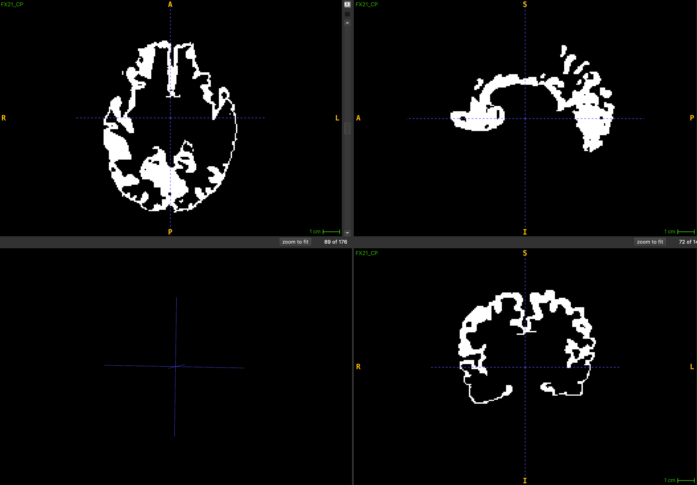

<h2 align="center">MRI Mask Hole Filling</h2>

  A post-processing tool for 3D NIfTI segmentation masks —
  fills diagonal disconnections and buffers thin regions
  to produce cleaner, more complete segmentation masks.

  <i>Built during a Summer Research Internship at the Sudha Gopalakrishnan Brain Centre, IIT Madras</i>

<h3>🧠 Overview</h3>

Segmentation masks generated from MRI data often contain small holes, diagonal disconnections,
and thin regions that break mask continuity. This tool processes 3D NIfTI masks slice-by-slice
(sagittal plane) and applies two patching steps to fill these gaps — without relying on
aggressive morphological operations that could alter the mask shape.

<h3>🖼️ Output</h3>

  

<i>Filled segmentation mask after hole patching</i>

<h3>⚙️ How It Works</h3>

<h4>Step 1 — Diagonal Patching</h4>

Iterates over each 2D sagittal slice and detects diagonal disconnections —
where two voxels are connected only diagonally (not 4-connected).
Fills the two bridging voxels to restore connectivity.

<h4>Step 2 — Thin Region Buffering</h4>

Detects voxels with 2 or fewer 4-connected neighbours (thin/sparse regions)
and dilates them using a diamond structuring element, adding voxels only
where the mask is currently empty.

<h4>Output Files</h4>
<pre><code>FX21_newseg.nii.gz       ← filled and patched mask
FX21_SegRefined.nii.gz   ← only the newly added voxels (for inspection)
</code></pre>

<h3>▶️ How to Run</h3>

<h4>Install dependencies</h4>
<pre><code>pip install nibabel numpy scipy scikit-image</code></pre>

<h4>Update the input file path</h4>
<pre><code># In hole_fill.py, update this line:
nii = nib.load("FX21_CP.nii.gz")  # replace with your segmentation mask path
</code></pre>

<h4>Run</h4>
<pre><code>python hole_fill.py</code></pre>

<h3>🛠️ Tech Stack</h3>
<ul>
  <li>Python</li>
  <li>NiBabel — NIfTI file I/O</li>
  <li>NumPy — array operations</li>
  <li>SciPy — binary dilation, convolution</li>
  <li>scikit-image — diamond structuring element</li>
</ul>

<h3>⚠️ Note</h3>

The filled mask may still contain some holes depending on the input segmentation quality.
Manual fine-tuning in ITK-SNAP or 3D Slicer is recommended after running this tool.

<h3>🏫 Context</h3>

  Built during a Summer Research Internship at the
  <b>Sudha Gopalakrishnan Brain Centre, IIT Madras</b>
  as part of a cortical palate segmentation refinement pipeline.

