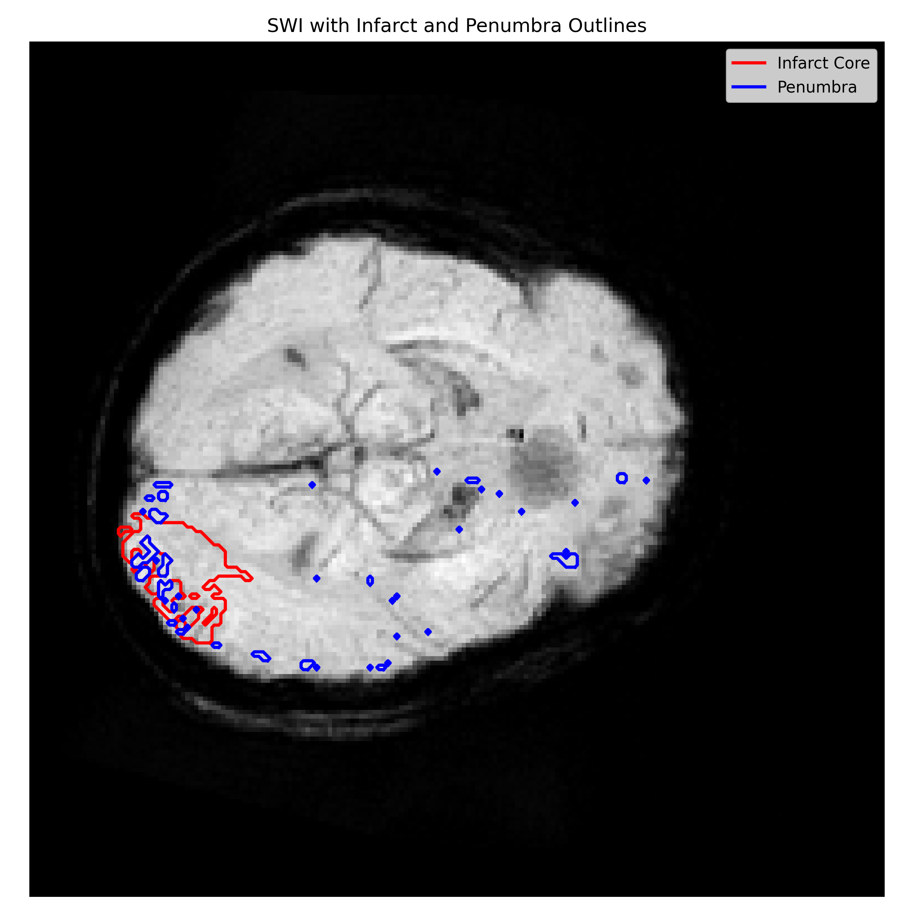

<h2 align="center">Penumbra Analysis Pipeline</h2>

  A multi-step MRI processing pipeline for ischemic stroke penumbra analysis —
  segmenting the infarct core, detecting veins from SWI, and computing the penumbra region.

<h3>🧠 Overview</h3>

The penumbra is the region of brain tissue surrounding an ischemic infarct core that is
at risk but potentially salvageable. This pipeline identifies the penumbra by combining
ADC, DWI, and SWI modalities — registering them to a common space, segmenting the
infarct core, detecting veins, and computing the penumbra as the difference.

<h3>🖼️ Output</h3>

  

<i>3D penumbra outline mask</i>

<h3>⚙️ Pipeline</h3>

<table>
  <tr>
    <th>Step</th>
    <th>Script</th>
    <th>Description</th>
    <th>Output</th>
  </tr>
  <tr>
    <td>1</td>
    <td><code>reg.py</code></td>
    <td>Rigid registration of SWI to ADC space using Mattes Mutual Information (SimpleITK)</td>
    <td><code>swi_reg.nii.gz</code></td>
  </tr>
  <tr>
    <td>2</td>
    <td><code>core.py</code></td>
    <td>Thresholds ADC + DWI to segment ischemic core; restricts to one hemisphere; keeps largest connected component</td>
    <td><code>core_mask.nii.gz</code></td>
  </tr>
  <tr>
    <td>3</td>
    <td><code>hypoperfused.py</code></td>
    <td>Detects hypoperfused/vein regions from registered SWI using top 5% intensity threshold; filters by hemisphere</td>
    <td><code>vein_mask.nii.gz</code></td>
  </tr>
  <tr>
    <td>4</td>
    <td><code>penumbra.py</code></td>
    <td>Computes penumbra as hypoperfused region minus infarct core (hypoperfused ∩ ¬core)</td>
    <td><code>penumbra_mask.nii.gz</code></td>
  </tr>
  <tr>
    <td>5</td>
    <td><code>penumbra_outline.py</code></td>
    <td>Generates 3D boundary of penumbra using morphological gradient (dilate XOR erode)</td>
    <td><code>penumbra_outline_mask.nii.gz</code></td>
  </tr>
</table>

<h3>📥 Required Inputs</h3>
<ul>
  <li><code>adc.nii.gz</code> — ADC map</li>
  <li><code>dwi.nii.gz</code> — DWI image</li>
  <li><code>swi.nii.gz</code> — SWI image (unregistered)</li>
  <li><code>brain_mask.nii.gz</code> — binary brain mask</li>
  <li><code>hemisphere.npy</code> — hemisphere indicator (<code>"left"</code> or <code>"right"</code>)</li>
</ul>

<h3>🔢 Thresholds Used</h3>
<pre><code>ADC core threshold : 100 – 690
DWI core threshold : 140 – 700
SWI vein threshold : top 5% intensity (95th percentile)
</code></pre>

<h3>▶️ How to Run</h3>

<h4>Install dependencies</h4>
<pre><code>pip install nibabel numpy scipy SimpleITK</code></pre>

<h4>Run in order</h4>
<pre><code>python reg.py              # Step 1 — register SWI to ADC
python core.py             # Step 2 — segment infarct core
python hypoperfused.py     # Step 3 — detect hypoperfused region
python penumbra.py         # Step 4 — compute penumbra
python penumbra_outline.py # Step 5 — generate 3D outline
</code></pre>

<h3>🛠️ Tech Stack</h3>
<ul>
  <li>Python</li>
  <li>NiBabel — NIfTI file I/O</li>
  <li>NumPy — array operations</li>
  <li>SciPy — connected component labelling, morphological operations</li>
  <li>SimpleITK — rigid image registration</li>
</ul>

<h3>🏫 Context</h3>
